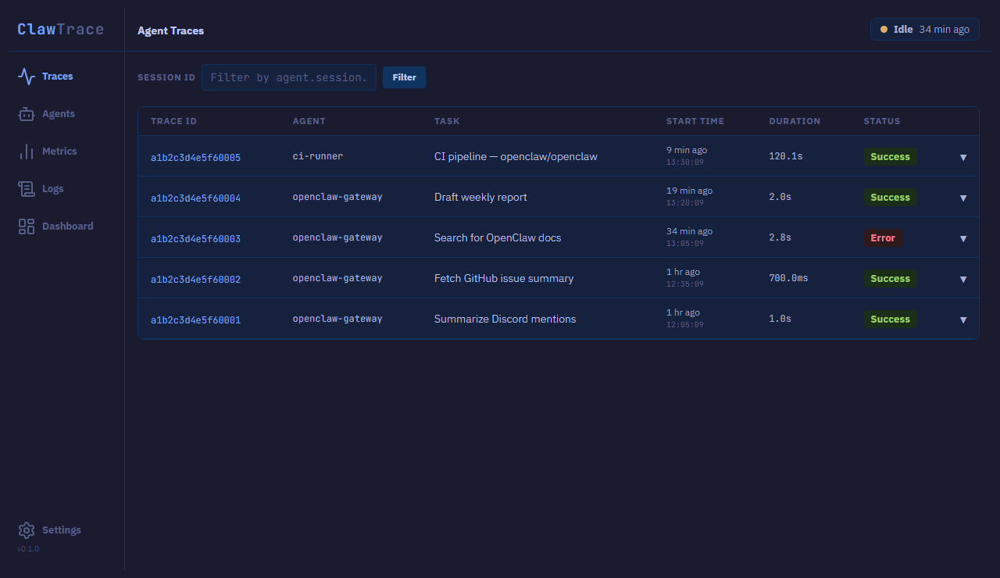
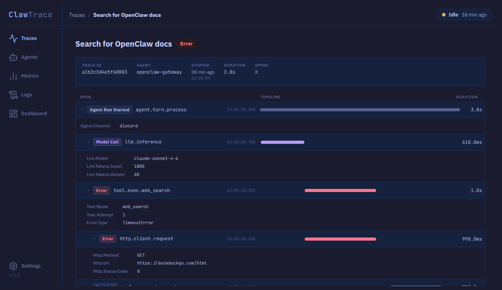
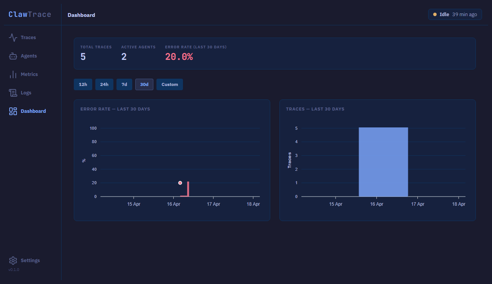

# ClawTrace

### Agent Observability for OpenClaw

<!-- CLAUDE_STATS_START -->
#### Claude Code Stats

     
<!-- CLAUDE_STATS_END -->

---







---

### Requirements

* Ruby 3.2 or higher
* Rails 8.0 or higher
* SQLite3 (stored locally on your machine)

---

### Description

ClawTrace is a Rails 8 agent observability platform built specifically for [OpenClaw](https://github.com/openclaw/openclaw). It gives developers full visibility into how their agents think, act, and fail — capturing traces, spans, metrics, and logs from live agent runs and surfacing them through a dashboard.

The platform accepts telemetry via a native OTLP/HTTP endpoint that OpenClaw targets out of the box. Traces, spans, metrics, and logs all write to the same storage layer and appear in the same UI.

This project is part of a personal portfolio and demonstrates experience with Ruby, Rails, OpenTelemetry-inspired design, API development, and AI-assisted development using [Claude Code](https://claude.ai/code).

---

### Features

#### Trace & Span Ingestion
- Trace → Span data model inspired by OpenTelemetry distributed tracing
- OTLP/HTTP ingestion via `POST /v1/traces` — accepts `application/json` and `application/x-protobuf`
- `parent_span_id` linking for full span hierarchy reconstruction
- ERROR status span detection and storage

#### Metrics Ingestion
- OTLP metrics via `POST /v1/metrics` — accepts `application/json` and `application/x-protobuf`
- Handles `sum`, `histogram`, and `gauge` metric types
- Filterable metrics index with per-metric time series view
- P50/P95/P99 estimation from histogram bucket data

#### Log Ingestion
- OTLP logs via `POST /v1/logs` — accepts `application/json` and `application/x-protobuf`
- Log records linked to traces and spans via `trace_id` + `span_id`
- All severity levels stored: DEBUG, INFO, WARN, ERROR, FATAL

#### Analysis Engine
- `TraceDurationCalculator` — execution duration per trace
- `ToolCallAnalyzer` — tool call frequency and success rates
- `ErrorRateAnalyzer` — error rate across traces
- `HistogramPercentileCalculator` — P50/P95/P99 from OTLP histogram buckets

#### Dashboard
- Trace list with status filtering
- Trace timeline with per-span metadata
- Metrics index and time series view
- Built with Hotwire (Turbo + Stimulus)

---

### Setup

```bash
git clone https://github.com/cskee004/claw-trace.git
cd claw-trace
bundle install
rails db:create db:migrate
rails server
```

Visit `http://localhost:3000`.

For active development with live Tailwind rebuilds, use `bin/dev`. On Windows, `bin/dev` (foreman) is not supported — run `rails server` and `rails tailwindcss:watch` in separate terminals instead.

---

### Data & Storage

ClawTrace uses SQLite — no external database required. All data lives in a single file:

```
storage/development.sqlite3
```

**Wiping all data**

Delete the file and recreate the database:

```bash
rm storage/development.sqlite3
rails db:create db:migrate
```

Or use the **Settings** page to selectively prune or delete logs, traces, and metrics without touching the database file.

**Retention defaults**

All three data types default to a 30-day retention window. Adjust per-type in Settings — prune runs on demand via the "Prune Now" button. There is no automatic background pruning; run it manually or set up a cron job with:

```bash
rails logs:prune
```

**Seed data**

A seed file is included for local development. It creates 5 traces, 30 spans, 5 metrics, and 5 logs:

```bash
rails db:seed
```

The seed is idempotent — running it multiple times is safe.

---

### Network & Security

ClawTrace binds to `127.0.0.1` by default. The server is only reachable from the machine it's running on — your agent telemetry stays local even if the machine is on an untrusted network.

To expose over your LAN (for example, viewing traces from a laptop while the server runs on a desktop), set `CLAWTRACE_BIND`:

```bash
CLAWTRACE_BIND=0.0.0.0 rails server
```

Only do this on networks you trust. ClawTrace's OTLP endpoints are unauthenticated by convention, so anyone on the same LAN can ingest or read traces once the server is exposed.

---

### API

#### OTLP Endpoints (OpenClaw native)

No authentication required — unauthenticated by OTLP convention. All endpoints return `{}` with HTTP 200 on success.

```
POST /v1/traces    — ingest OTLP trace payload (ResourceSpans)
POST /v1/metrics   — ingest OTLP metrics payload (ResourceMetrics)
POST /v1/logs      — ingest OTLP log payload (ResourceLogs)
```

Both `application/json` and `application/x-protobuf` content types are accepted.

OpenClaw configuration:
```json
{
  "diagnostics": {
    "enabled": true,
    "otel": {
      "enabled": true,
      "endpoint": "http://localhost:3000",
      "protocol": "http/protobuf",
      "serviceName": "openclaw-gateway",
      "traces": true,
      "metrics": true,
      "logs": true,
      "sampleRate": 1,
      "flushIntervalMs": 30000
    }
  }
}
```

---

### Service Layer

All business logic lives in `app/lib/` — never in controllers.

| Class | Responsibility |
|---|---|
| `TelemetryIngester` | Validates and persists traces and spans |
| `OtlpNormalizer` | Translates OTLP trace payloads into the Trace → Span model |
| `MetricsNormalizer` | Translates OTLP metrics payloads into `Metric` records |
| `LogsNormalizer` | Translates OTLP log payloads into `Log` records |
| `OtlpProtobufDecoder` | Pure-Ruby proto3 decoder for binary OTLP payloads |
| `TraceDurationCalculator` | Calculates trace execution duration in milliseconds |
| `ToolCallAnalyzer` | Analyzes tool call frequency and success rates |
| `ErrorRateAnalyzer` | Detects error spans and computes error rate |
| `HistogramPercentileCalculator` | Estimates P50/P95/P99 from histogram bucket data |

---

### Testing

```bash
bundle exec rspec        # full test suite
bundle exec rubocop      # lint
bundle exec brakeman     # security scan
```

Test coverage includes service class unit specs (`spec/lib/`), model specs, and request specs for all API endpoints.

---

### Roadmap

- [x] Trace → Span data model and storage
- [x] OTLP trace ingestion (`/v1/traces`)
- [x] OTLP metrics ingestion (`/v1/metrics`)
- [x] OTLP log ingestion (`/v1/logs`)
- [x] Protobuf support across all three OTLP endpoints
- [x] Analysis engine (duration, tool calls, error rate, histogram percentiles)
- [x] Trace list with waterfall span timeline
- [x] Real-time trace updates via Turbo Streams
- [x] Metrics dashboard with ApexCharts
- [x] Agents inventory and per-agent show page
- [x] Logs index with severity and trace filtering
- [x] Dashboard with error rate and trace volume charts
- [x] Data retention settings (prune/delete per data type)