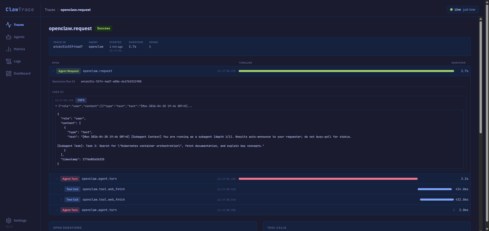
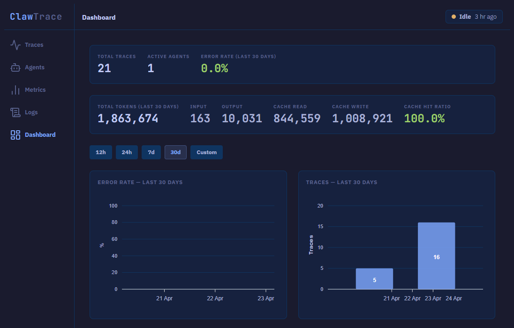

# ClawTrace

### Agent Observability for OpenClaw

### Description

ClawTrace is a Rails 8 agent observability platform built for [OpenClaw](https://github.com/openclaw/openclaw). It gives developers full visibility into how their agents think, act, and fail — capturing traces, spans, metrics, and logs from live agent runs.

The primary integration is the [`@clawtrace-io/clawtails`](docs/openclaw-plugin.md) companion plugin, which instruments OpenClaw's lifecycle hooks and emits OTLP spans with full parent-child hierarchy. Each agent turn becomes a waterfall: root span → agent turn → tool calls, with token usage and correlated logs on every span.

Traces, spans, metrics, and logs all write to a local SQLite database and appear in the same UI. No external services required.

This project is part of a personal portfolio and demonstrates experience with Ruby, Rails, OpenTelemetry-inspired design, API development, and AI-assisted development using [Claude Code](https://claude.ai/code).

---





---

### Quick Start

Install the companion plugin into your OpenClaw project to get the full waterfall view — agent turns, tool calls, token usage, and correlated logs:

```bash
openclaw plugins install @clawtrace-io/clawtails
```

Then add both blocks to `~/.openclaw/openclaw.json`. Diagnostics sends metrics; the plugin handles traces and logs:

```json
"diagnostics": {
  "enabled": true,
  "otel": {
    "enabled": true,
    "endpoint": "http://localhost:3000",
    "protocol": "http/protobuf",
    "serviceName": "openclaw-gateway",
    "traces": false,
    "metrics": true,
    "logs": false,
    "sampleRate": 1,
    "flushIntervalMs": 30000
  }
}
```

```json
"plugins": {
  "entries": {
    "clawtails": {
      "enabled": true,
      "config": {
        "endpoint": "http://localhost:3000",
        "logs": {
          "enabled": true,
          "tool_calls": true,
          "assistant_turns": true,
          "user_messages": true,
          "compaction_events": true
        }
      }
    }
  }
}
```

**Or, without the plugin** — use OpenClaw's built-in diagnostics for flat spans and metrics (no waterfall view):

```json
"diagnostics": {
  "enabled": true,
  "otel": {
    "enabled": true,
    "endpoint": "http://localhost:3000",
    "protocol": "http/protobuf",
    "serviceName": "openclaw-gateway",
    "traces": true,
    "metrics": true,
    "logs": true,
    "sampleRate": 1,
    "flushIntervalMs": 30000
  }
}
```

Then start ClawTrace:

```bash
git clone https://github.com/cskee004/claw-trace.git
cd claw-trace
bundle install
rails db:create db:migrate
rails server
```

Visit `http://localhost:3000`. Send a message in OpenClaw — the trace appears immediately.

For full plugin configuration options, see [docs/openclaw-plugin.md](docs/openclaw-plugin.md).

> **Without the plugin:** OpenClaw's built-in OTLP diagnostics (`diagnostics.otel`) send flat spans that show as a compact single-span card. The waterfall view requires the `clawtails` plugin.

---

### Requirements

* Ruby 3.2 or higher
* Rails 8.0 or higher
* SQLite3 (stored locally on your machine)

---

### Features

#### Companion Plugin (`@clawtrace-io/clawtails`)
- Instruments OpenClaw lifecycle hooks — no agent code changes required
- Emits `openclaw.request → openclaw.agent.turn → openclaw.tool.*` span hierarchy
- Attaches token usage, model name, stop reason, and cost to each agent turn span
- Emits correlated OTLP logs (tool inputs/outputs, assistant messages, compaction events)
- One config line; configurable endpoint for remote ClawTrace instances

#### Trace & Span Ingestion
- Trace → Span data model inspired by OpenTelemetry distributed tracing
- OTLP/HTTP ingestion via `POST /v1/traces` — accepts `application/json` and `application/x-protobuf`
- `parent_span_id` linking for full span hierarchy reconstruction
- Span type taxonomy: `agent_request`, `agent_turn`, `tool_call`, `model_call`, `message_event`, `session_event`, `command_event`, `webhook_event`
- Error detection via OTLP status code or `openclaw.outcome` attribute

#### Log Correlation
- OTLP logs via `POST /v1/logs` — accepts `application/json` and `application/x-protobuf`
- Logs linked to traces and spans via `trace_id` + `span_id`
- Log entries render inline in the waterfall span drawer with JSON expand
- `openclaw.subsystem` facet filter on logs index and trace detail
- All severity levels stored: DEBUG, INFO, WARN, ERROR, FATAL

#### Metrics Ingestion
- OTLP metrics via `POST /v1/metrics` — accepts `application/json` and `application/x-protobuf`
- Rolling aggregation: one row per metric key, updated on each ingestion
- Metrics index with hourly bucket time series; dashboard tiles for agent turns, token usage, and tool errors

#### Solarized Light Theme
- Opt-in light theme via a sun/moon toggle button in the nav sidebar
- Full Solarized Light palette — 10 base vars + 8 span-type colors mapped to Solarized equivalents
- `prefers-color-scheme` auto-detection with localStorage manual override (`clawtrace-theme`)
- FOUC-free: theme is applied synchronously in `<head>` before stylesheets load
- All span-type colors preserve their semantic meaning across both themes

#### Cost Control
- Per-span cost computed from token counts × live model pricing (LiteLLM community JSON, cached 24 h)
- Estimated cost shown on the traces index, trace summary strip, and per-span in the waterfall drawer
- Model rate (per 1M input / output tokens) displayed alongside each span cost
- Daily budget alerts via `BudgetChecker` — run on a cron schedule, prints to stdout, pipes to OS notifications
- `bin/rails spans:backfill_cost` — one-time backfill for spans ingested before cost tracking was enabled

#### Analysis Engine
- `TraceDurationCalculator` — execution duration per trace
- `ToolCallAnalyzer` — tool call frequency and success rates
- `ErrorRateAnalyzer` — error rate across traces
- `TokenAggregator` — input/output/cache token totals and cache-hit ratio per period

#### Dashboard
- Trace list with status and agent filtering
- Waterfall span timeline with per-span drawer (token usage, logs, metadata)
- Metrics dashboard with stat tiles and time series charts
- Agents inventory and per-agent show page
- Built with Hotwire (Turbo + Stimulus)

---

### Setup

See [Quick Start](#quick-start) above for the install steps.

For active development with live Tailwind rebuilds, use `bin/dev`. On Windows, `bin/dev` (foreman) is not supported — run `rails server` and `rails tailwindcss:watch` in separate terminals instead.

---

### Data & Storage

ClawTrace uses SQLite — no external database required. All data lives in a single file:

```
storage/development.sqlite3
```

**Wiping all data**

Delete the file and recreate the database:

```bash
rm storage/development.sqlite3
rails db:create db:migrate
```

Or use the **Settings** page to selectively prune or delete logs, traces, and metrics without touching the database file.

**Retention defaults**

All three data types default to a 30-day retention window. Adjust per-type in Settings — prune runs on demand via the "Prune Now" button. There is no automatic background pruning; run it manually or set up a cron job with:

```bash
rails logs:prune
```

**Budget alerts**

Set a daily spend limit per agent on the agent show page. Then run `BudgetChecker` on a schedule to get notified when an agent goes over budget:

```bash
# Log budget check output every hour
0 * * * * cd /path/to/clawtrace && bin/rails runner BudgetChecker.check >> /tmp/clawtrace-budget.log 2>&1

# macOS — pipe BUDGET ALERT lines to terminal-notifier
0 * * * * cd /path/to/clawtrace && bin/rails runner BudgetChecker.check | grep "BUDGET ALERT" | terminal-notifier -title "ClawTrace"

# Linux — fire notify-send if any agent is over budget
0 * * * * cd /path/to/clawtrace && bin/rails runner BudgetChecker.check | grep -q "BUDGET ALERT" && notify-send "ClawTrace Budget Alert" "An agent is over budget"
```

**Seed data**

A seed file is included for local development. It creates 5 traces, 30 spans, 5 metrics, and 5 logs:

```bash
rails db:seed
```

The seed is idempotent — running it multiple times is safe.

---

### Network & Security

ClawTrace binds to `127.0.0.1` by default. The server is only reachable from the machine it's running on — your agent telemetry stays local even if the machine is on an untrusted network.

To expose over your LAN (for example, viewing traces from a laptop while the server runs on a desktop), set `CLAWTRACE_BIND`:

```bash
CLAWTRACE_BIND=0.0.0.0 rails server
```

Only do this on networks you trust. ClawTrace's OTLP endpoints are unauthenticated by convention, so anyone on the same LAN can ingest or read traces once the server is exposed.

---

### API

#### OTLP Endpoints

No authentication required. All endpoints return `{}` with HTTP 200 on success. Both `application/json` and `application/x-protobuf` are accepted.

```
POST /v1/traces    — OTLP trace payload (ResourceSpans)
POST /v1/metrics   — OTLP metrics payload (ResourceMetrics)
POST /v1/logs      — OTLP log payload (ResourceLogs)
```

**Recommended:** Use `@clawtrace-io/clawtails` — it handles all three endpoints automatically. See [docs/openclaw-plugin.md](docs/openclaw-plugin.md).

**Alternative (flat spans only):** Point OpenClaw's built-in diagnostics at ClawTrace directly:

```json
{
  "diagnostics": {
    "otel": {
      "enabled": true,
      "endpoint": "http://localhost:3000"
    }
  }
}
```

This produces flat spans (no parent-child hierarchy) — each event shows as a compact card, not a waterfall.

**Send a test span manually:**

```bash
curl http://localhost:3000/v1/traces \
  -X POST \
  -H "Content-Type: application/json" \
  -d '{
  "resourceSpans": [{
    "resource": {
      "attributes": [
        {"key": "service.name", "value": {"stringValue": "openclaw"}}
      ]
    },
    "scopeSpans": [{
      "spans": [{
        "traceId": "aabbccddeeff00112233445566778899",
        "spanId": "aabbccddeeff0011",
        "name": "openclaw.agent.turn",
        "startTimeUnixNano": "1776353057612000000",
        "endTimeUnixNano": "1776353064358000000",
        "attributes": [
          {"key": "openclaw.model",                 "value": {"stringValue": "claude-sonnet-4-5"}},
          {"key": "openclaw.provider",              "value": {"stringValue": "anthropic"}},
          {"key": "openclaw.stop_reason",           "value": {"stringValue": "end_turn"}},
          {"key": "openclaw.sessionKey",            "value": {"stringValue": "agent:main"}},
          {"key": "gen_ai.usage.input_tokens",      "value": {"stringValue": "1024"}},
          {"key": "gen_ai.usage.output_tokens",     "value": {"stringValue": "256"}},
          {"key": "gen_ai.usage.cache_read_tokens", "value": {"stringValue": "8192"}}
        ],
        "status": {"code": 1}
      }]
    }]
  }]
}'
```

Returns `{}` with HTTP 200 on success. The span appears on the Traces page immediately.

For the full OTLP attribute reference, span type mapping, and example payloads, see [docs/api/otlp.md](docs/api/otlp.md) and the [OpenClaw Integration Guide](docs/openclaw-integration.md).

---

### Service Layer

All business logic lives in `app/lib/` — never in controllers.

| Class | Responsibility |
|---|---|
| `TelemetryIngester` | Validates and persists traces and spans |
| `OtlpNormalizer` | Translates OTLP trace payloads into the Trace → Span model |
| `MetricsNormalizer` | Translates OTLP metrics payloads into `Metric` records |
| `LogsNormalizer` | Translates OTLP log payloads into `Log` records |
| `OtlpProtobufDecoder` | Pure-Ruby proto3 decoder for binary OTLP payloads |
| `TraceDurationCalculator` | Calculates trace execution duration in milliseconds |
| `ToolCallAnalyzer` | Analyzes tool call frequency and success rates |
| `ErrorRateAnalyzer` | Detects error spans and computes error rate |
| `TokenAggregator` | Aggregates input/output/cache token totals and cache-hit ratio |
| `MetricAggregator` | Upserts rolling metric totals by metric key |
| `MetricChartBuilder` | Builds ApexCharts option hashes and stat-strip data from `Metric` records |

---

### Testing

```bash
bundle exec rspec        # full test suite
bundle exec rubocop      # lint
bundle exec brakeman     # security scan
```

Test coverage includes service class unit specs (`spec/lib/`), model specs, and request specs for all API endpoints.

---

### AI Development

ClawTrace was built almost entirely with [Claude Code](https://claude.ai/code).
The development workflow uses three files to prevent context drift across sessions:
`CLAUDE.md` (AI instructions and conventions), `.claude/resources/AI_ARCHITECTURE.md`
(architecture reference), and `.claude/resources/AI_TASKS.md` (numbered task log).

See [docs/ai-development.md](docs/ai-development.md) for how the system works
and how to adapt it for your own project.

<!-- CLAUDE_STATS_START -->
#### Claude Code Stats

     
<!-- CLAUDE_STATS_END -->

---

### Roadmap

- [x] Trace → Span data model and storage
- [x] OTLP trace ingestion (`/v1/traces`)
- [x] OTLP metrics ingestion (`/v1/metrics`)
- [x] OTLP log ingestion (`/v1/logs`)
- [x] Protobuf support across all three OTLP endpoints
- [x] Analysis engine (duration, tool calls, error rate, token aggregation)
- [x] Trace list with waterfall span timeline
- [x] Real-time trace updates via Turbo Streams
- [x] Metrics dashboard with stat tiles and hourly time series charts
- [x] Agents inventory and per-agent show page
- [x] Logs index with severity, trace, and subsystem filtering
- [x] Dashboard with error rate and trace volume charts
- [x] Data retention settings (prune/delete per data type)
- [x] Companion plugin (`@clawtrace-io/clawtails`) — full waterfall hierarchy from OpenClaw lifecycle hooks
- [x] Log correlation — logs render inline in waterfall drawer with JSON expand
- [x] Token usage and model metadata on agent turn spans